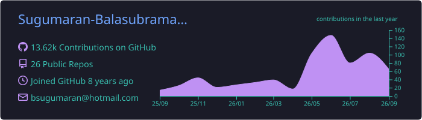
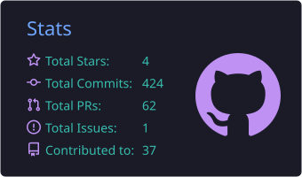
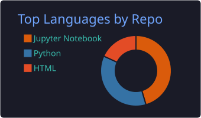
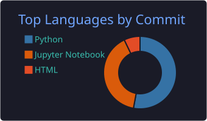
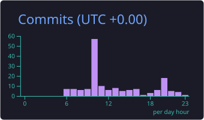

<p align="center">
  
</p>

<p align="center">
  <a href="https://github.com/Sugumaran-Balasubramaniyan">
    
  </a>
</p>

<p align="center">
  <a href="https://sugumaran-balasubramaniyan.com"></a>
  <a href="https://www.linkedin.com/in/sugumaranbalasubramaniyan"></a>
  <a href="https://huggingface.co/sugumaran"></a>
  <a href="https://github.com/Sugumaran-Balasubramaniyan"></a>
  <a href="mailto:bsugumaran@hotmail.com"></a>
  <a href="https://github.com/sponsors/Sugumaran-Balasubramaniyan"></a>
</p>

---

### ⚡ Executive Persona & System Vision

```yaml
# ─── EXECUTIVE TELEMETRY & SYSTEM IDENTITY ───────────────────────────
architect:
  name: "Sugumaran Balasubramaniyan"
  roles:
    - "Senior AI/ML Systems Architect"
    - "Professor of AI & Data Science @ SKEMA Business School (Paris)"
  location: "Paris, France 🇫🇷"
  experience: "7+ Years (Production MLOps, LLM Systems, Enterprise ML)"
  prior_experience: ["Capgemini", "Infosys", "Les Compagnons de Paris"]

core_specializations:
  agentic_orchestration:
    - "Autonomous Multi-Agent Swarms & Task-Graph Execution Loops"
    - "Deterministic Guardrail Firewalls, Sandbox Isolation & Tool Telemetry"
  retrieval_and_rag:
    - "Sub-20ms Hybrid PGVector HNSW Search (Dense Embeddings + BM25 Sparse)"
    - "Multi-Stage Document Decomposition, Cross-Encoder Re-Ranking"
  clinical_evaluations:
    - "Adversarial LLM-as-Judge Protocols & Automated Hallucination Detection"
    - "Medical Diagnostic Benchmarking Suites (MedQA, USMLE 4-Option Ground Truth)"
  production_infrastructure:
    - "High-Throughput Model Serving (vLLM, Ollama, Triton) & Async FastAPI Backends"
    - "Zero-Downtime Containerized Deployments (Docker, Kubernetes, GitHub Actions)"

mission_statement: >
  Bridging rigorous academic research with production-grade engineering. 
  Architecting deterministic, secure, and ultra-low-latency AI systems at scale.
```

---

### 🚀 Featured Production Architectures & Deep Tech

<table width="100%">
  <thead>
    <tr>
      <th align="left" width="32%">Repository / System</th>
      <th align="left" width="48%">Architecture Highlights & Deep Tech Scope</th>
      <th align="center" width="20%">CI / Quality Gate</th>
    </tr>
  </thead>
  <tbody>
    <tr>
      <td>
        <a href="https://github.com/Sugumaran-Balasubramaniyan/enterprise-agentic-rag"><b>enterprise-agentic-rag</b></a><br/>
        <sub><i>Production Agentic RAG Platform</i></sub><br/>
        <code>Python</code> <code>PGVector</code> <code>FastAPI</code> <code>Streamlit</code>
      </td>
      <td>
        Autonomous multi-step tool calling engine with PGVector HNSW hybrid search (&lt;20ms latency), dynamic query decomposition, context reranking, and deterministic guardrail firewalls.
      </td>
      <td align="center">
        <a href="https://github.com/Sugumaran-Balasubramaniyan/enterprise-agentic-rag/actions"></a>
      </td>
    </tr>
    <tr>
      <td>
        <a href="https://github.com/Sugumaran-Balasubramaniyan/clinical-llm-eval"><b>clinical-llm-eval</b></a><br/>
        <sub><i>Clinical Reasoning Benchmark Suite</i></sub><br/>
        <code>Python</code> <code>LLM-as-Judge</code> <code>MedQA</code> <code>PyTorch</code>
      </td>
      <td>
        Harness for benchmarking LLM clinical diagnostics. Features term-matching ground-truth evaluation, automated hallucination detection, and multi-model scoring across frontier LLMs.
      </td>
      <td align="center">
        <a href="https://github.com/Sugumaran-Balasubramaniyan/clinical-llm-eval/actions"></a>
      </td>
    </tr>
    <tr>
      <td>
        <a href="https://github.com/Sugumaran-Balasubramaniyan/hermes-agent"><b>hermes-agent</b></a><br/>
        <sub><i>Autonomous AI Agent Framework</i></sub><br/>
        <code>Python</code> <code>AsyncIO</code> <code>Multi-Agent</code> <code>Tool-Use</code>
      </td>
      <td>
        Core contributor to autonomous AI agent tooling. Features terminal execution engines, workspace isolation, cron scheduling, subagent mesh coordination, and MCP server integrations.
      </td>
      <td align="center">
        <a href="https://github.com/Sugumaran-Balasubramaniyan/hermes-agent/actions"></a>
      </td>
    </tr>
    <tr>
      <td>
        <a href="https://github.com/Sugumaran-Balasubramaniyan/Advanced-Machine-Learning"><b>Advanced-Machine-Learning</b></a><br/>
        <sub><i>Applied ML & XAI Architecture</i></sub><br/>
        <code>Scikit-learn</code> <code>XGBoost</code> <code>SHAP</code> <code>Jupyter</code>
      </td>
      <td>
        Production ML curriculum and reference implementations: gradient boosting, probabilistic models, explainable AI (SHAP / LIME), and high-dimensional feature engineering pipelines.
      </td>
      <td align="center">
        <a href="https://github.com/Sugumaran-Balasubramaniyan/Advanced-Machine-Learning/actions"></a>
      </td>
    </tr>
    <tr>
      <td>
        <a href="https://github.com/Sugumaran-Balasubramaniyan/Python-for-Data-Science"><b>Python-for-Data-Science</b></a><br/>
        <sub><i>Production DS Toolkit</i></sub><br/>
        <code>Pandas</code> <code>NumPy</code> <code>Matplotlib</code> <code>Seaborn</code>
      </td>
      <td>
        End-to-end data science foundation framework engineered for high-throughput exploratory data analysis, statistical hypothesis testing, and vectorized data transformations.
      </td>
      <td align="center">
        <a href="https://github.com/Sugumaran-Balasubramaniyan/Python-for-Data-Science/actions"></a>
      </td>
    </tr>
    <tr>
      <td>
        <a href="https://github.com/Sugumaran-Balasubramaniyan/Data-Science-Foundations-Data-Mining"><b>Data-Science-Foundations</b></a><br/>
        <sub><i>Data Mining & Extraction</i></sub><br/>
        <code>ETL</code> <code>Data Mining</code> <code>Pattern Recognition</code>
      </td>
      <td>
        Data mining algorithms, large-scale data harvesting architectures, unstructured document parsing, and topological pattern discovery for massive raw datasets.
      </td>
      <td align="center">
        <a href="https://github.com/Sugumaran-Balasubramaniyan/Data-Science-Foundations-Data-Mining/actions"></a>
      </td>
    </tr>
  </tbody>
</table>

---

### 🛠️ Production Engineering Matrix

<p align="center">
  
</p>

<table width="100%">
  <tr>
    <td width="33%" valign="top">
      <b>🧠 LLM Systems & AI Architecture</b><br/><br/>
      
      
      <br/>
      
      
      <br/>
      
      
    </td>
    <td width="33%" valign="top">
      <b>⚡ Backend & Cloud Infrastructure</b><br/><br/>
      
      
      <br/>
      
      
      <br/>
      
      
    </td>
    <td width="34%" valign="top">
      <b>📊 Data Engineering & Vector Stores</b><br/><br/>
      
      <br/>
      
      
      <br/>
      
      
    </td>
  </tr>
</table>

---

### 📊 Telemetry Dashboard & Engineering Velocity

<p align="center">
  <a href="https://github.com/Sugumaran-Balasubramaniyan">
    
  </a>
</p>

<p align="center">
  
  
</p>

<p align="center">
  
  
  
</p>

---

### 🎓 Academic Leadership & Research

<details open>
  <summary><b>🏛️ Faculty of AI & Data Science @ SKEMA Business School (Paris Campus)</b></summary>
  <br/>
  <blockquote>
    <i>"Empowering the next generation of AI systems architects and quantitative data scientists through rigorous theoretical grounding and production-grade engineering excellence."</i>
  </blockquote>

  <ul>
    <li><b>Advanced Machine Learning & Predictive Analytics:</b> Leading MSc curricula on ensemble architectures, gradient boosted decision trees (XGBoost/LightGBM), neural networks, probabilistic estimation, and Explainable AI (XAI / SHAP).</li>
    <li><b>Data Science Foundations & High-Dimensional Mining:</b> Architecting core foundations for exploratory analysis, statistical significance, and scalable unstructured data ETL pipelines.</li>
    <li><b>Generative AI & Agentic Systems in Business:</b> Designing applied seminars on enterprise RAG implementations, LLM benchmarking, prompt optimization, and AI governance frameworks.</li>
    <li><b>Mentorship & Research Incubation:</b> Supervising 500+ postgraduate theses, capstone projects, and industry partnerships with European tech leaders.</li>
  </ul>
</details>

---

<p align="center">
  
</p>

<p align="center">
  
  <br/><br/>
  <i>"The best way to predict the future is to architect and build it."</i>
  <br/>
  <sub>© Sugumaran Balasubramaniyan • Paris, France</sub>
</p>
